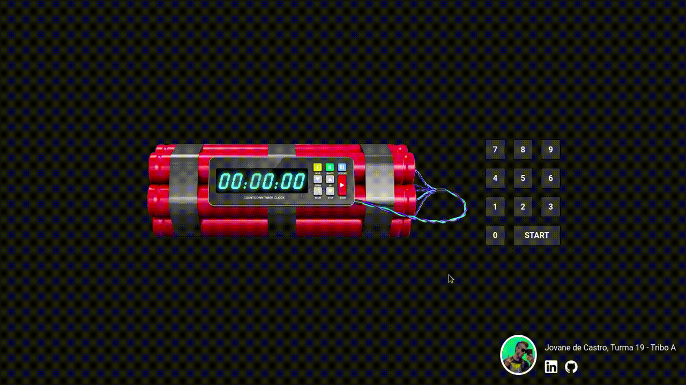

# 💣 Bomb O'Clock
 

I developed Bomb O'Clock to start using npm and vite as my standard react tooling. This project has the intention to be used during intervals of Trybe classes.

## ✨ Features
- Automatic **time conversion** (00:00:90 ➡️ 00:01:30)
- **Explosion sound** when timer hits 00:00:00
- Style modularization with **CSS Modules**
- **Mobile** version

# 📹 Demo
